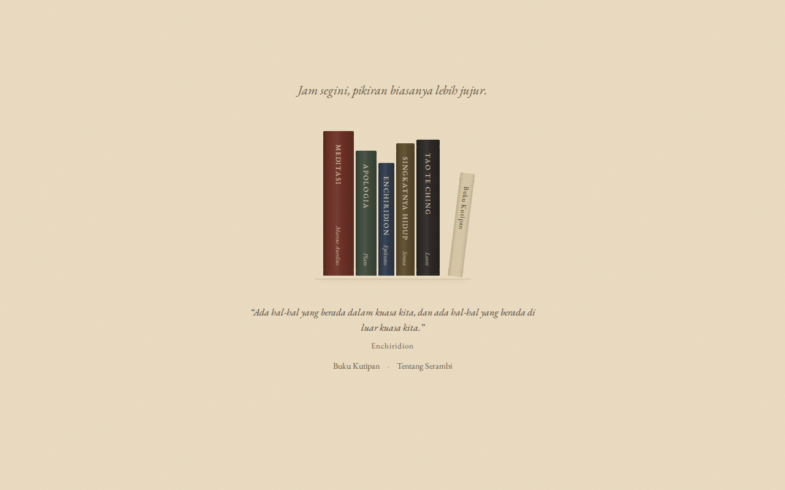
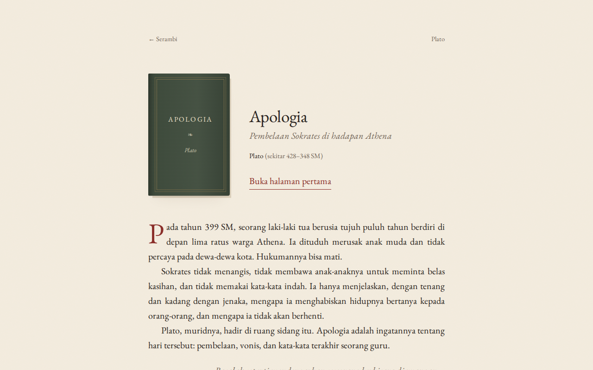
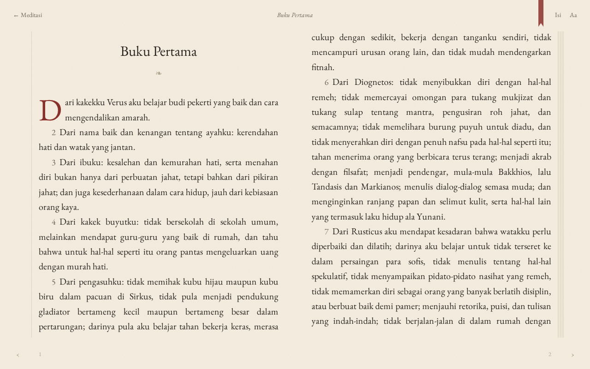
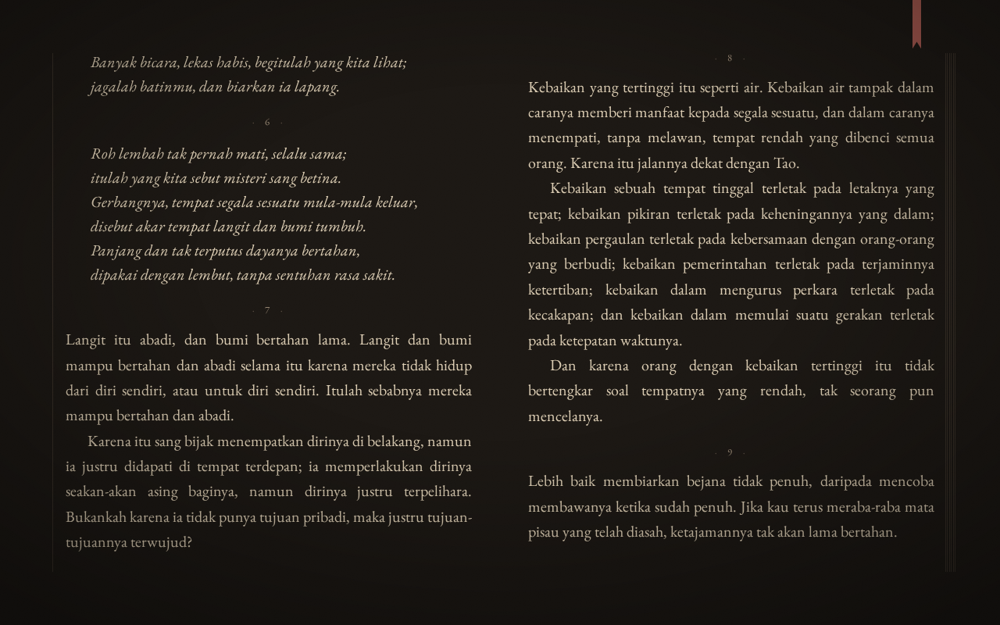
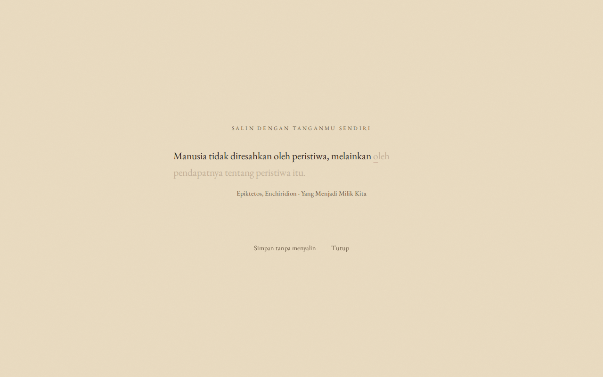
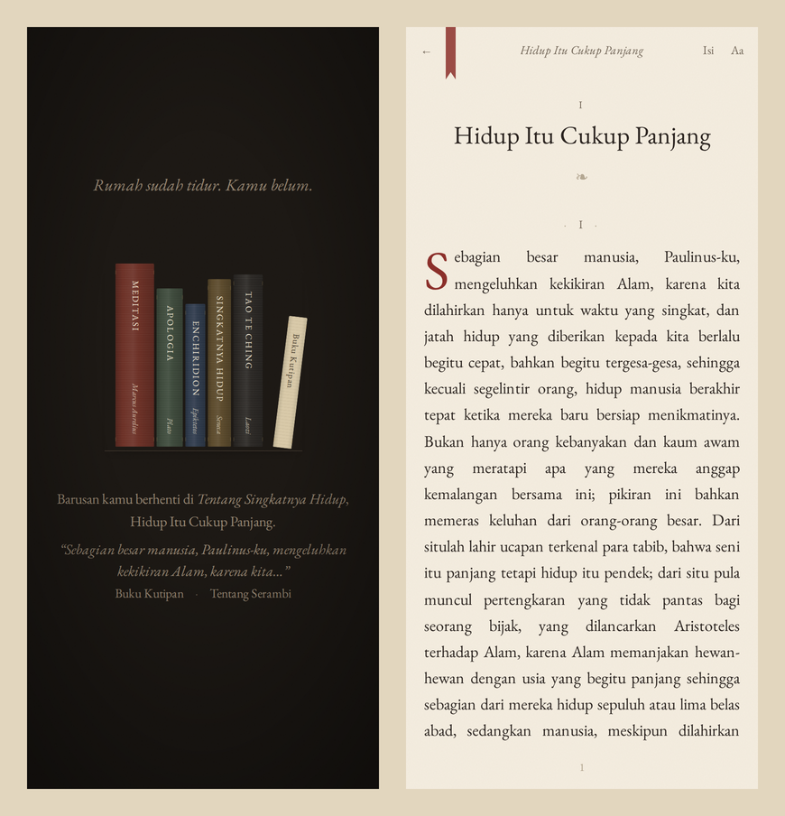

# Serambi

A quiet place to read philosophy, slowly.

Serambi is a small reading site for classic philosophy texts, available in Indonesian and English. No accounts, no ads, no tracking. Just a bookshelf, pages you can turn, and a little space to write.



## Books

All texts are in the public domain.

| Book | Author | English translation |
| --- | --- | --- |
| Meditations | Marcus Aurelius | George Long (1862) |
| Apology | Plato | Benjamin Jowett (1871) |
| Enchiridion | Epictetus | T. W. Higginson (1865) |
| On the Shortness of Life | Seneca | Aubrey Stewart (1900) |
| Tao Te Ching | Laozi | James Legge (1891) |

English texts are sourced from [Project Gutenberg](https://www.gutenberg.org/). The Indonesian versions are aligned paragraph by paragraph with the English, so switching languages keeps your place.

## Features

- Book-like pagination: two-page spreads on wide screens, single pages on mobile
- Three reading moods (Morning, Dusk, Candle) or automatic based on time of day
- Pencil underlines and margin notes
- A personal quote book, where quotes are saved by retyping them
- A short reflection prompt at the end of each chapter
- Optional ambient sound (rain, fireplace) generated with the Web Audio API
- Remembers where you stopped reading
- Works offline after first visit and can be installed as a PWA

All reader data is stored locally in the browser (`localStorage`). Nothing is sent to a server.

## Screenshots

| | |
| --- | --- |
|  |  |
|  |  |



## Getting started

Requires Node.js 22 or later.

```bash
npm install
npm run dev
```

Open `http://localhost:4321`.

To build the static site:

```bash
npm run build
```

The output in `dist/` can be deployed to any static host (Netlify, Vercel, Cloudflare Pages, GitHub Pages).

## Project structure

```
content/<book>/en/   English chapters (generated by scripts/extract.py)
content/<book>/id/   Indonesian chapters, aligned with en/
sources/             Raw Project Gutenberg texts
scripts/             Text extraction and alignment check
src/data/            Book metadata, reflection prompts, daily quotes
src/scripts/         Reader and sound logic
```

Chapter files use a simple plain-text format: paragraphs separated by blank lines, `## I` for section markers, and lines starting with `|` for verse.

## Contributing

Translation fixes are welcome. Edit the files in `content/<book>/id/` and keep the same number of blocks as the matching English file. You can verify alignment with:

```bash
npm run check-content
```

This check also runs automatically before every build.

## License

Code is released under the MIT License. Source texts from Project Gutenberg are in the public domain.
